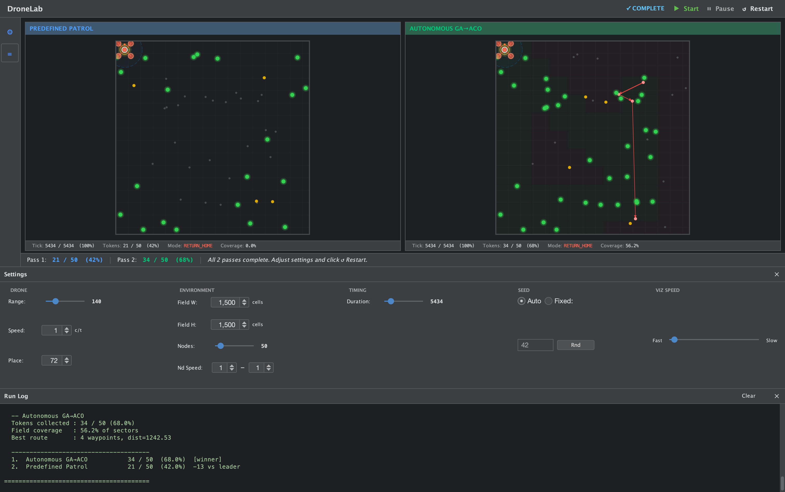

# DroneLab — A UAV/WSN Simulator

Discrete-event Java simulator for comparing UAV data-collection strategies in a
wireless sensor network (WSN). Multiple intelligence strategies run side-by-side
against the same randomly-generated field, and the results are compared in a
ranked console report and a live multi-panel GUI.



*Predefined Patrol (left) vs Autonomous GA→ACO (right) — seed 42, 50 nodes, 1500×1500 field.
GA→ACO collected 31/50 tokens (62%) vs patrol's 26/50 (52%). See the [interface guide](docs/interface.md) for a full walkthrough of the UI.*

---

## Paper

This simulator was built for and is described in:

> **Path Planning And Trajectory for UAVs**
> Tarek Uddin Ahmed — MSc dissertation, Queen Mary University of London, 2022.
> *Preprint coming soon on arXiv.*

If you use this simulator in your research, please cite using the metadata in
[`CITATION.cff`](CITATION.cff) (GitHub shows a *Cite this repository* button,
or run `cffconvert` locally). Once the arXiv preprint is live, update the `url`
field in `CITATION.cff` with the arXiv link.

---

## Credits

**Tarek Uddin Ahmed** ([TechnoTwelve](https://github.com/TechnoTwelve)) —
MSc candidate, Queen Mary University of London. Designed and implemented the
novel GA→ACO→LocalSearch path planning algorithm, the 8-way movement system,
and the coverage-gated detour trigger. Refactored the codebase into the layered
architecture documented here, and added the autonomous frontier exploration, GUI,
and test suite.

**Dr Umair Bilal Chaudhry** — Dissertation supervisor (Queen Mary University of
London) and author of the original simulation framework on which this work is
built. The core event-driven simulation model, node mobility model, and predefined
UAV trajectory with 4-way movement originate from his work. This project extends
and refactors that foundation into a modular, extensible research platform.

---

## Build & Run

**Prerequisites:** Java 17+, Maven 3.6+ (or use IntelliJ IDEA — open as a Maven
project and run `Main` directly).

```bash
# Build an executable JAR
mvn package -DskipTests

# Run with GUI (default) — launches one panel per configured intelligence
# Run from the project root so config.properties is found in the working directory
java -jar target/drone-lab.jar

# Run headless — text-only output, faster for batch sweeps
java -jar target/drone-lab.jar --headless

# Run tests
mvn test
```

The set of intelligences that run, and every simulation parameter, are
controlled by `config.properties` at the project root.

Architecture docs: `docs/architecture.md`
UML diagram source: `docs/uml-refactored.puml` (paste at plantuml.com)

---

## config.properties Reference

All runtime toggles and simulation parameters live in `config.properties`.
The file is loaded once at startup by `AppConfig` and applied globally.

```properties
# ------------ run settings ------------
run.headless      = false          # true = no GUI; false = show simulation panels
run.seed          =                # integer for reproducible RNG; leave empty for random
run.intelligences = patrol,gaaco   # comma-separated keys; each key runs one simulation pass

# ------------ field & nodes ------------
simulation.fieldWidth     = 1500
simulation.fieldHeight    = 1500
simulation.nodeCount      = 50
simulation.nodeIdStart    = 5000
simulation.nodeRange      = 100
simulation.nodeMinSpeed   = 1
simulation.nodeMaxSpeed   = 1

# ------------ drone ------------
simulation.droneRange     = 140
simulation.dronePlacement = 72
simulation.droneSpeed     = 1
simulation.duration       = 5434
```

### Key properties

| Property | Default | Description |
|---|---|---|
| `run.headless` | `false` | Skip the Swing GUI and print results only. Useful for automated sweeps. |
| `run.seed` | *(empty)* | Integer seed applied to every pass in the run, ensuring all strategies face identical node layouts. Leave empty for a fresh random run each time. |
| `run.intelligences` | `patrol,gaaco` | Comma-separated list of registered intelligence keys. Each key maps to one simulation pass. The console report ranks all strategies by tokens collected. |
| `simulation.fieldWidth` / `fieldHeight` | `1500` | Simulation grid dimensions in cells. |
| `simulation.nodeCount` | `50` | Sensor nodes deployed randomly at startup. |
| `simulation.nodeIdStart` | `5000` | First node ID; nodes are numbered `5000, 5001, …`. |
| `simulation.nodeRange` | `100` | Node-to-node detection radius. Used to build neighbour caches, which the UAV ingests transitively when it scans a node. |
| `simulation.nodeMinSpeed` / `nodeMaxSpeed` | `1` | Uniform movement speed range for nodes (cells per tick). |
| `simulation.droneRange` | `140` | UAV scan radius in cells. Also used as the `CoverageGrid` sector size — one sector per scan footprint. |
| `simulation.dronePlacement` | `72` | UAV home row *and* column. Patrol corners sit near `(72, 72)`, `(72, 1428)`, etc. |
| `simulation.droneSpeed` | `1` | UAV movement speed (cells per tick). |
| `simulation.duration` | `5434` | Total simulation ticks (≈ one perimeter lap + 10). |

---

## SimulationConfig

`AppConfig` reads `config.properties` and builds a `SimulationConfig`. For
programmatic use call `SimulationConfig.defaults()` (which delegates to
`AppConfig`) and override with `withXxx()` copy methods or via the builder:

```java
// withXxx copy-and-override
SimulationConfig config = SimulationConfig.defaults()
    .withDroneRange(200)
    .withNodeCount(100);

// Builder pattern
SimulationConfig config = SimulationConfig.builder()
    .fieldSize(2000, 2000)
    .nodeCount(100)
    .droneRange(200)
    .duration(8000L)
    .build();
```

`SimulationConfig` holds **only environment parameters** (field size, node
mobility, drone physics). Algorithm-specific parameters such as planning
thresholds, coverage gates, and route length limits live in the algorithm's
own config class (e.g. `GaAcoConfig`).

---

## Intelligence Strategies

Each strategy is identified by a short key registered in `AppConfig.REGISTRY`
and activated by adding that key to `run.intelligences` in `config.properties`.

### `patrol` — Predefined Patrol (`PredefinedPatrolIntelligence`)

Baseline strategy. The UAV follows a fixed W1→W2→W3→W4 corner loop for the
entire run with no path planning. Useful as the comparison baseline.

### `gaaco` — Autonomous GA-ACO (`GaAcoIntelligence`)

Autonomous strategy that combines frontier-based exploration with a three-stage
GA→ACO→LocalSearch path planner:

1. **Frontier patrol** — during `PATROL` mode, steers toward the nearest
   unvisited `CoverageGrid` sector rather than looping fixed corners.
2. **Coverage-gated replanning** — triggers `replan(coverage)` once 40% of the
   field is scanned and the KB reaches the planning threshold.
3. **Scanned-sector filter** — excludes nodes whose sector has already been
   visited from the route, preventing local-minima re-routing.

Config knob: `GaAcoConfig.defaults()` (see below).

---

## Algorithm Configs

### GaAcoConfig (`algorithm.gaaco.GaAcoConfig`)

Hyperparameters for the GA→ACO→LocalSearch planner **and** the planning
schedule used by `GaAcoIntelligence`. All fields are immutable; use
`withXxx()` to produce single-field variants.

```java
GaAcoConfig alg = GaAcoConfig.defaults()
    .withGenerationCount(30)
    .withPlanningThreshold(10);
```

**GA parameters**

| Parameter | Default | Description |
|---|---|---|
| `populationSize` | `20` | Number of chromosomes in the GA population. |
| `generationCount` | `15` | GA generations per `planRoute()` call. |
| `mutationRate` | `0.09` | Probability of swap mutation per chromosome. |
| `tournamentSize` | `2` | Candidates considered per GA tournament selection. |
| `eliteCount` | `1` | Top chromosome(s) copied unchanged into the next generation. |

**ACO parameters**

| Parameter | Default | Description |
|---|---|---|
| `antCount` | `10` | ACO ants. Ant 1 seeds the pheromone matrix from the GA route; ants 2–N build tours concurrently. |
| `pheromoneInit` | `0.2` | Uniform initial pheromone level τ₀ (must be in (0, 1)). |
| `q` | `0.08` | Pheromone deposit constant. Deposit per edge = `q / tour_length`. |
| `rho` | `0.2` | Pheromone evaporation rate per ACO iteration (0–1). |
| `alpha` | `0.1` | Pheromone influence exponent (α). |
| `beta` | `11.0` | Distance influence exponent (β). Higher values strongly prefer shorter edges. |
| `acoIterationCount` | `5` | ACO ant-batch + pheromone-update cycles per `planRoute()` call. |

**Planning schedule** (owned by `GaAcoIntelligence`, not `SimulationConfig`)

| Parameter | Default | Description |
|---|---|---|
| `planningThreshold` | `15` | Minimum KB node count before replanning fires. |
| `planningInterval` | `25` | Minimum ticks between successive replan checks. |
| `minCoverageBeforePlan` | `0.05` | Field fraction (0–1) that must be scanned before the first replan. Near-zero lets the first replan happen almost immediately. |
| `maxRouteWaypoints` | `12` | Maximum waypoints per planned route. Compact routes complete in ~500–800 ticks. |

---

## UAV Drive Modes

| Mode | Trigger | Behaviour |
|---|---|---|
| `PATROL` | Default at startup; after each route completes | Steers to nearest unvisited `CoverageGrid` sector (autonomous intelligences) or falls back to the fixed W1→W2→W3→W4 corner loop when all sectors are covered (patrol baseline). |
| `EXECUTE` | After a successful `replan()` | Follows the planned route waypoint by waypoint using predictive interception. Reverts to `PATROL` when the last waypoint is reached. |
| `RETURN_HOME` | When remaining ticks ≤ Chebyshev distance to home + 10 | Navigates directly back to `(dronePlacement, dronePlacement)`. Triggered universally by `SimulationRunner` for all strategies. No frontier steering or replanning fires in this mode. |

---

## Adding a New Intelligence

Three steps — no changes to `UAV`, `SimulationRunner`, `Main`, or the GUI.

### Step 1 — Implement `UAVIntelligence`

```java
package intelligence;

import algorithm.Route;
import algorithm.gaaco.GaAcoConfig;
import simulation.*;

public final class MyIntelligence implements UAVIntelligence {

    private final SimulationConfig config;
    private final GaAcoConfig      algConfig;   // owns planning-schedule knobs
    private final CoverageGrid     coverage;

    public MyIntelligence(SimulationConfig config) {
        this.config    = config;
        this.algConfig = GaAcoConfig.defaults();  // or accept via constructor
        this.coverage  = new CoverageGrid(
            config.getFieldWidth(),
            config.getFieldHeight(),
            config.getDroneRange());
    }

    @Override
    public Route onTick(long tick, UAV uav, Environment env) {
        // Track coverage every tick (including EXECUTE mode)
        coverage.markScanned(uav.getX(), uav.getY(), config.getDroneRange());

        // Steer toward unvisited sectors during PATROL
        if (uav.getDriveMode() == UAV.DriveMode.PATROL) {
            int[] frontier = coverage.nearestUnvisitedCenter(uav.getX(), uav.getY());
            if (frontier != null) uav.setExplorationTarget(frontier[0], frontier[1]);
            else                  uav.clearExplorationTarget();
        }

        // Replan when coverage and KB thresholds are met.
        // Planning-schedule knobs (threshold, interval, coverage gate, max waypoints)
        // live on GaAcoConfig, not SimulationConfig.
        if (uav.getDriveMode() == UAV.DriveMode.PATROL
                && uav.getKnowledgeBase().size() >= algConfig.getPlanningThreshold()
                && tick % algConfig.getPlanningInterval() == 0
                && coverage.coverageFraction() >= algConfig.getMinCoverageBeforePlan()) {
            return uav.replan(coverage);  // pass coverage to exclude scanned sectors
        }

        return null;
    }

    @Override public String getLabel()             { return "My Intelligence"; }
    @Override public CoverageGrid getCoverageGrid() { return coverage; }
}
```

### Step 2 — Register in `AppConfig`

Open `src/main/java/config/AppConfig.java` and add one line to the static initialiser:

```java
static {
    REGISTRY.put("patrol", sim -> new PredefinedPatrolIntelligence());
    REGISTRY.put("gaaco",  sim -> new GaAcoIntelligence(sim, GaAcoConfig.defaults()));
    REGISTRY.put("mine",   sim -> new MyIntelligence(sim));   // ← add this
}
```

### Step 3 — Add the key to `config.properties`

```properties
run.intelligences = patrol,gaaco,mine
```

The GUI gains a new panel automatically; the console report includes the new
strategy in the ranked comparison.

---

### UAVIntelligence interface contract

| Method | Required | Notes |
|---|---|---|
| `onTick(tick, uav, env): Route` | Yes | Return a `Route` to activate it immediately; return `null` to keep current behaviour. Called after `uav.scan()` and `uav.moveStep()`. |
| `getLabel(): String` | Yes | Name shown in the console report and GUI sidebar. |
| `getCoverageGrid(): CoverageGrid` | No (default `null`) | Override to expose your coverage tracker to the GUI and final statistics. |

### Key UAV methods available in `onTick`

| Method | Description |
|---|---|
| `uav.getDriveMode()` | `PATROL`, `EXECUTE`, or `RETURN_HOME`. Guard all replanning on `PATROL`. |
| `uav.getKnowledgeBase().size()` | Number of nodes currently known to the UAV. |
| `uav.getKnowledgeBase().snapshot()` | Unmodifiable `List<SensorNode>` of all known nodes. |
| `uav.isTokenized(nodeId)` | Whether a node has already been directly scanned. |
| `uav.getX()` / `uav.getY()` | Current UAV position (row, column). |
| `uav.getTotalTokens()` | Total unique direct-scan contacts collected so far. |
| `uav.replan()` | Plan a route from untokenized KB nodes; no sector filter. |
| `uav.replan(coverage)` | Plan a route, additionally excluding nodes in already-scanned sectors. Recommended to avoid local minima. |
| `uav.setExplorationTarget(x, y)` | Steer the UAV toward `(x, y)` during `PATROL`. |
| `uav.clearExplorationTarget()` | Revert to the fixed four-corner patrol loop. |

### Return-home (automatic)

`SimulationRunner` automatically calls `uav.returnHome()` for every intelligence
when remaining ticks ≤ Chebyshev distance to the home cell + 10. The
`PATROL` mode guard in your `onTick` already prevents frontier steering and
replanning from firing during `RETURN_HOME`.

---

## Adding a New PathPlanner

`PathPlanner` (`src/algorithm/PathPlanner.java`) is the interface for route
optimisation. Implement it to swap in a different algorithm:

```java
package algorithm;

import domain.SensorNode;
import java.util.List;

public final class GreedyNearestNeighbour implements PathPlanner {

    @Override
    public Route planRoute(List<SensorNode> nodes) {
        // Build a greedy nearest-neighbour tour.
        // Route is constructed as: new Route(orderedList)
        return new Route(nodes); // placeholder
    }
}
```

Inject it into the UAV via `SimulationRunner.runOnce()` (replace
`new GaAcoPlanner(...)`):

```java
PathPlanner planner = new GreedyNearestNeighbour();
UAV uav = new UAV(config, planner);
```

`UAV` has no knowledge of the concrete planner — it calls only
`planner.planRoute(List<SensorNode>)` through the interface.

---

## Project Structure

```
pom.xml                              Maven build (Java 17, JUnit 5, executable JAR)
config.properties                    Runtime configuration (run settings, field/drone params)
src/
  main/
    java/
      Main.java                      Entry point (loads AppConfig, builds GUI, starts runner)
      config/
        AppConfig.java               Intelligence registry + config.properties loader
      domain/
        SensorNode.java              Immutable node value object (position + velocity)
      algorithm/
        PathPlanner.java             Strategy interface: planRoute(List<SensorNode>): Route
        Route.java                   Immutable ordered node sequence (fitness precomputed)
        gaaco/
          GaAcoConfig.java           GA-ACO + planning-schedule hyperparameters (withXxx)
          GaAcoPlanner.java          Three-stage GA -> ACO -> LocalSearch pipeline
          GeneticAlgorithm.java      Tournament selection, order crossover, swap mutation, 2-opt
          AntColonyOptimization.java Concurrent ACO with pheromone snapshot
          LocalSearch.java           2-opt + or-opt post-processing
          PheromoneMatrix.java       Pheromone state with defensive-copy snapshot()
          Population.java            Mutable chromosome container for GA
      simulation/
        SimulationConfig.java        Immutable environment parameters (field, nodes, drone)
        SimulationRunner.java        Discrete-event loop + N-strategy comparison + ranking
        UAV.java                     Drone entity (scan, move, replan, return-home)
        UAVIntelligence.java         Strategy interface for per-tick UAV behaviour
        CoverageGrid.java            Sector-based field coverage tracker + frontier query
        KnowledgeBase.java           Per-UAV node accumulator (observe, snapshot)
        Environment.java             Grid + agent registry (O(n) range queries)
        NodeAgent.java               Mutable simulation entity (live position, neighbour cache)
        NodeMover.java               O(1) grid movement helper
        NodeDeploymentStrategy.java  Strategy interface for initial node placement
        EventScheduler.java          Priority-queue event scheduler (O(log n))
        MovementStrategy.java        Strategy interface for mobility models
        SimulationScenario.java      Scenario wiring (UAV + planner + intelligence list)
      movement/
        MarkovChain.java             Markov transition matrix (levyWalk, exploratoryWalk)
        LevyWalkStrategy.java        Configurable Markov walk (implements MovementStrategy)
      intelligence/
        PredefinedPatrolIntelligence.java  Baseline: fixed 4-corner patrol, no planning
        GaAcoIntelligence.java             Autonomous: frontier exploration + gated GA-ACO replan
      ui/
        SimulationGui.java           JFrame with N panels (one per intelligence) + stats sidebar
        SimulationPanel.java         Custom dark-theme renderer (nodes, UAV, routes, coverage)
        SimulationSnapshot.java      Immutable state copy for EDT rendering
        VisualizationListener.java   @FunctionalInterface GUI callback: onTick(SimulationSnapshot)
      algorithmTest/
        GaAcoTest.java               Self-contained GA-ACO demo (run via IntelliJ or mvn exec)
      scenarios/
        WSNDataCollectionScenario.java  Wires the default WSN data-collection scenario
    resources/
      config.properties              Bundled defaults (overridden by the root config.properties)
  test/
    java/
      algorithm/
        RouteTest.java               Unit tests for Route (fitness, ordering, edge cases)
        MarkovChainTest.java         (placeholder — tests live in simulation/)
      simulation/
        MarkovChainTest.java         Unit tests for MarkovChain transition probabilities
        EnvironmentTest.java         Unit tests for Environment range queries
        NodeMoverTest.java           Unit tests for NodeMover grid movement
docs/
  architecture.md                    Full architecture documentation
  uml-refactored.puml                PlantUML class diagram (paste at plantuml.com)
  uml-legacy.puml                    PlantUML class diagram (legacy monolithic code)
```

---

## Empirical Results

**50-node, 1500 × 1500 field, droneRange = 140, 20-seed sweep**

- GA-ACO wins 16/20 seeds vs. predefined patrol
- Average improvement: **+17.84 %** more tokens collected vs. patrol baseline

The autonomous UA's advantage comes from three mechanisms working together:

1. **Frontier exploration** — systematic full-field coverage instead of
   perimeter-only patrol
2. **Coverage gate** — waits until 40 % of field is scanned before committing
   to routes
3. **Scanned-sector filter in replan** — prevents re-routing to
   already-explored regions, eliminating local-minima loops

