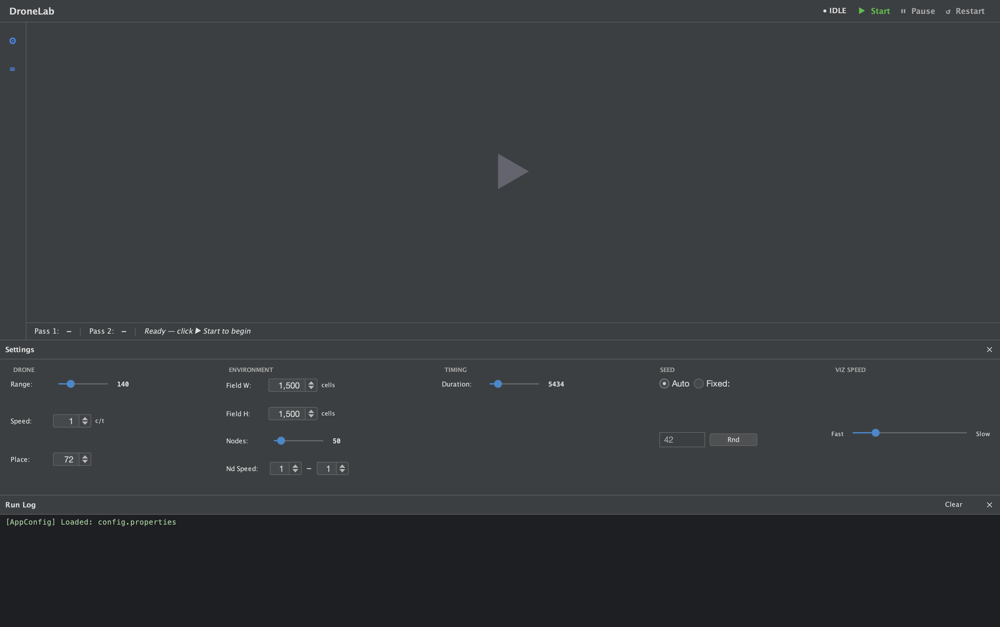
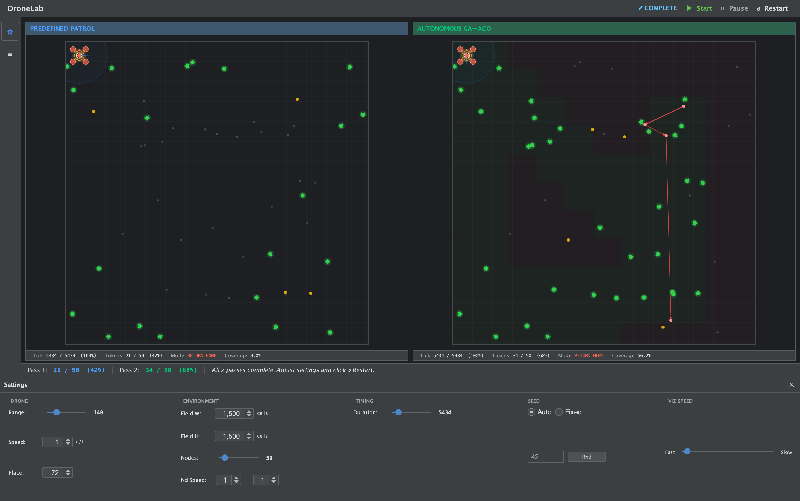
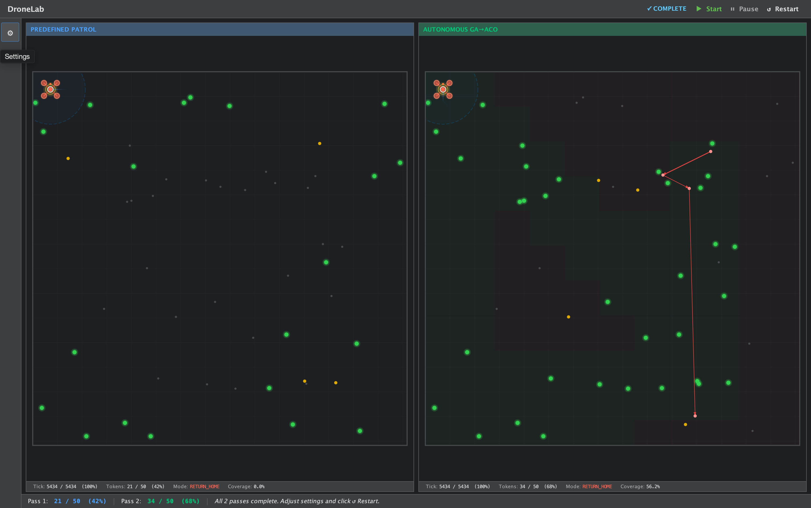
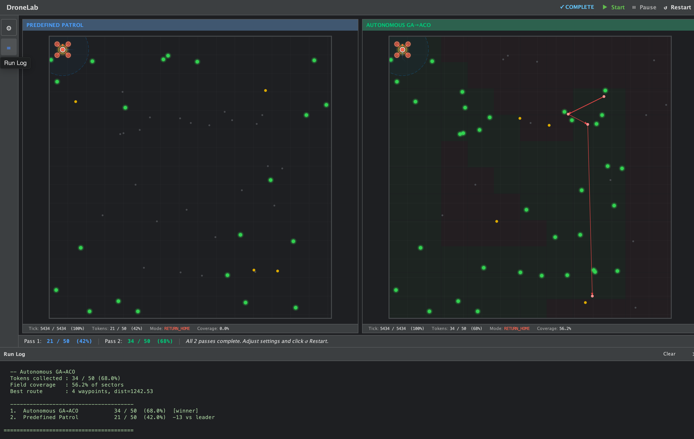

# Interface Guide — DroneLab

A walkthrough of the DroneLab GUI for new users and researchers.

---

## 1. Idle State



When the application first loads, the simulation is in **IDLE** state. The canvas
shows a centred play button. The **Settings** panel is accessible at any time via
the gear icon (top-left) or the hamburger menu.

## 2. Settings Panel



### Settings panel

| Section | Controls | Notes |
|---|---|---|
| **DRONE** | Range, Speed, Place | `Range` = scan radius in cells. `Speed` = cells per tick. `Place` = home row/column (UAV starts here). |
| **ENVIRONMENT** | Field W, Field H, Nodes, Nd Speed | Field dimensions and node count. `Nd Speed` sets the min–max node movement speed range. |
| **TIMING** | Duration | Total simulation ticks. Default 5434 ≈ one perimeter lap + 10. |
| **SEED** | Auto / Fixed | `Auto` = fresh random seed each run. `Fixed` = enter an integer for reproducible results. The `Rnd` button picks a random fixed seed. |
| **VIZ SPEED** | Fast ↔ Slow slider | Controls the delay between rendered ticks. Drag left for faster playback. |

Changes take effect on the next **Start** or **Restart**.

---

## 3. Mid-Run — Both Panels Active



Once **Start** is clicked, both passes run concurrently. Each panel shows:

### Canvas elements

| Element | Colour | Meaning |
|---|---|---|
| Unknown nodes | Dark grey dot | Node known transitively (neighbour-of-neighbour) but not yet directly scanned |
| Known nodes | Amber/yellow dot | Node in the UAV's knowledge base — candidate for route planning |
| Tokenized nodes | Green dot with glow | Node directly scanned — token collected |
| UAV (PATROL) | Blue/cyan ring | Navigating toward nearest unvisited frontier sector |
| UAV (EXECUTE) | Cyan ring | Following a GA→ACO planned route |
| UAV (RETURN_HOME) | Red/orange ring | Returning to home cell at run end |
| Scan radius | Faint blue circle | UAV's current scan footprint |
| Route lines | Red lines | Active planned waypoint sequence |
| History trail | Fading blue | Recent UAV path (newest = brightest) |
| Prediction trail | Fading orange | Projected path toward next frontier target |
| Coverage overlay | Subtle green tint | Sectors already visited by the UAV |

### Stats bar (below each canvas)

```
Tick: 2134 / 5434 (39%)   Tokens: 18 / 50 (36%)   Mode: PATROL   Coverage: 38.2%
```

| Field | Description |
|---|---|
| Tick | Current tick / total duration (% complete) |
| Tokens | Unique direct-scan contacts / total nodes (% of field tokenized) |
| Mode | Current UAV drive mode: PATROL, EXECUTE, or RETURN_HOME |
| Coverage | Fraction of CoverageGrid sectors marked as visited |

### Status bar (bottom of window)

Shows a live comparison across all passes:
```
Pass 1: 18 / 50 (36%)  |  Pass 2: 21 / 50 (42%)
```

---

## 4. Completed Run — Results


## 5. Run Log



When all passes finish, the status indicator switches to **COMPLETE** (green tick).

### Run Log

The run log at the bottom prints a structured summary per pass and a final ranked
comparison table:

```
-- Autonomous GA->ACO
Tokens collected : 31 / 50 (62.0%)
Field coverage   : 52.9% of sectors
Best route       : 3 waypoints, dist=1188.30

--------------------------------------
1. Autonomous GA-ACO    31 / 50  (62.0%)  [winner]
2. Predefined Patrol    26 / 50  (52.0%)  -5 vs leader
======================================
```

**Interpreting results:**
- **Tokens collected** — primary metric. Higher is better. Each node grants one token on first direct scan contact.
- **Field coverage** — proportion of `CoverageGrid` sectors visited. The GA→ACO strategy achieves systematic coverage; the patrol baseline covers only the perimeter.
- **Best route** — the final GA→ACO planned route (waypoints + total distance). Routes are replanned dynamically as the KB grows.
- **Ranked table** — all strategies ranked by tokens, with delta vs. the leader shown for each.

### After a run

- **Restart** — resets all passes and reruns with the same settings (new seed if Auto, same seed if Fixed).
- **Settings** — adjust parameters before restarting.
- The run log persists until you click **Clear** or **Restart**.

---

## Panel Titles

Each panel title shows the algorithm key from `config.properties`:

| Title | Algorithm |
|---|---|
| `PREDEFINED PATROL` | `patrol` key — fixed 4-corner patrol, no planning |
| `AUTONOMOUS GA→ACO` | `gaaco` key — frontier exploration + GA→ACO replanning |

To add a third panel, add a new key to `run.intelligences` in `config.properties`.
See the [developer guide](developer-guide.md) for how to implement a new strategy.

---

## Keyboard / Controls

| Control | Action |
|---|---|
| **Start** | Begin all simulation passes |
| **Pause / Resume** | Freeze / unfreeze rendering and simulation |
| **Restart** | Reset and rerun with current settings |
| Gear icon (⚙) | Toggle Settings panel |
| Hamburger (☰) | Toggle Run Log panel |
